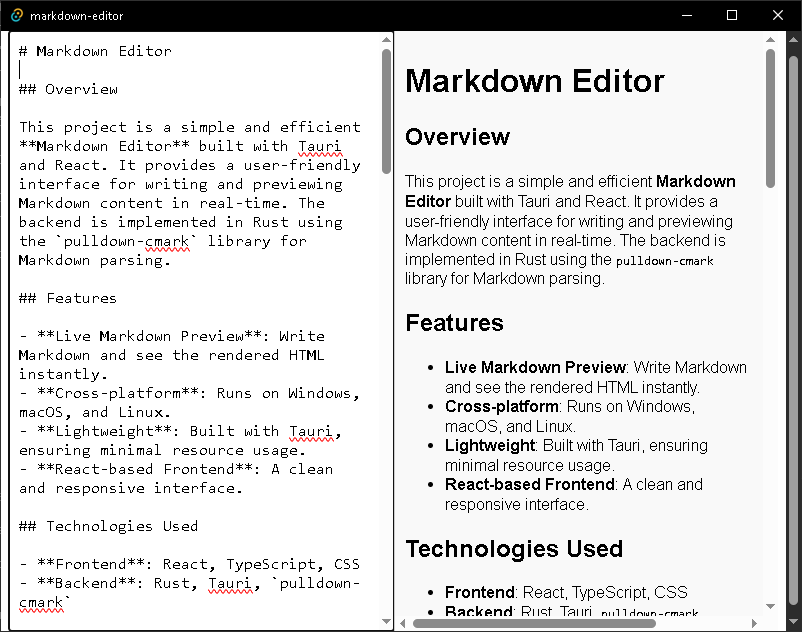

# Markdown Editor



## Overview

This project is a simple and efficient **Markdown Editor** built with Tauri and React. It provides a user-friendly interface for writing and previewing Markdown content in real-time. The backend is implemented in Rust using the `pulldown-cmark` library for Markdown parsing.

## Features

- **Live Markdown Preview**: Write Markdown and see the rendered HTML instantly.
- **Cross-platform**: Runs on Windows, macOS, and Linux.
- **Lightweight**: Built with Tauri, ensuring minimal resource usage.
- **React-based Frontend**: A clean and responsive interface.

## Technologies Used

- **Frontend**: React, TypeScript, CSS
- **Backend**: Rust, Tauri, `pulldown-cmark`

## Getting Started

Follow these instructions to set up the project on your local machine.

### Prerequisites

Ensure you have the following installed:

- [Node.js](https://nodejs.org/) (v16 or newer)
- [Rust](https://www.rust-lang.org/tools/install)
- [Tauri CLI](https://tauri.app/v2/guides/getting-started/prerequisites)

### Installation

1. Clone the repository:

   ```bash
   git clone https://github.com/Cod-e-Codes/rust-markdown-editor.git
   cd rust-markdown-editor
   ```

2. Install frontend dependencies:

   ```bash
   npm install
   ```

3. Build the Tauri app:

   ```bash
   npm run tauri build
   ```

### Running the App

For development purposes:

```bash
npm run tauri dev
```

This command will launch the app in development mode.

## Project Structure

- **`src-tauri`**: Contains the Rust backend code.
  - `main.rs`: Sets up the Tauri app and defines the `parse_markdown` command.
- **`src`**: Contains the React frontend code.
  - `App.tsx`: Main React component for the Markdown editor.
  - `App.css`: Styles for the editor and preview panel.

## Commands

### `parse_markdown`

A Tauri command implemented in Rust to convert Markdown input to HTML using the `pulldown-cmark` library.

## Contributing

Contributions are welcome! Feel free to submit a pull request or open an issue for improvements and bug fixes.

### Steps to Contribute

1. Fork the repository.
2. Create a new branch:
   ```bash
   git checkout -b feature-branch-name
   ```
3. Commit your changes:
   ```bash
   git commit -m "Add your message here"
   ```
4. Push to the branch:
   ```bash
   git push origin feature-branch-name
   ```
5. Open a pull request.

## License

This project is licensed under the MIT License. See the [LICENSE](LICENSE) file for details.

## Author

**Cody Marsengill**  
[GitHub Profile](https://github.com/Cod-e-Codes)

